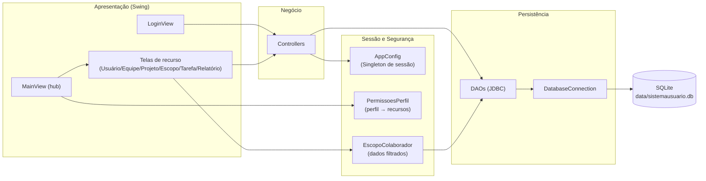
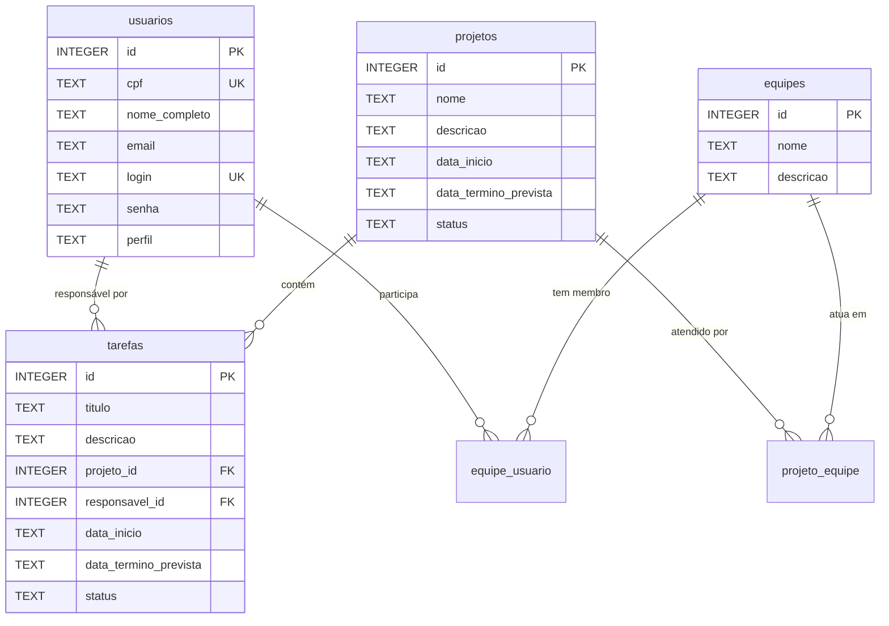
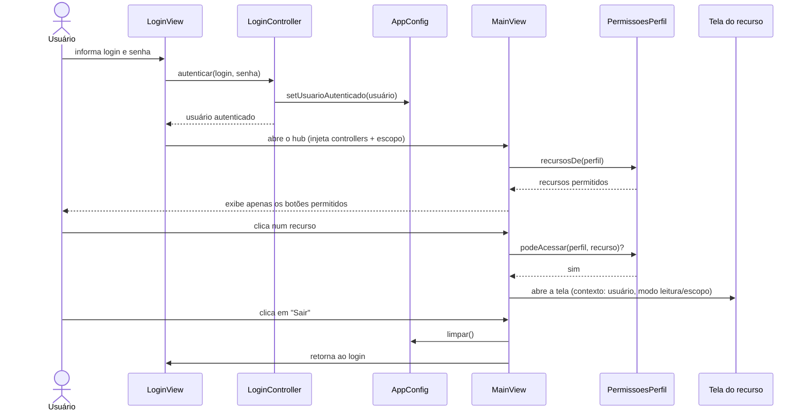
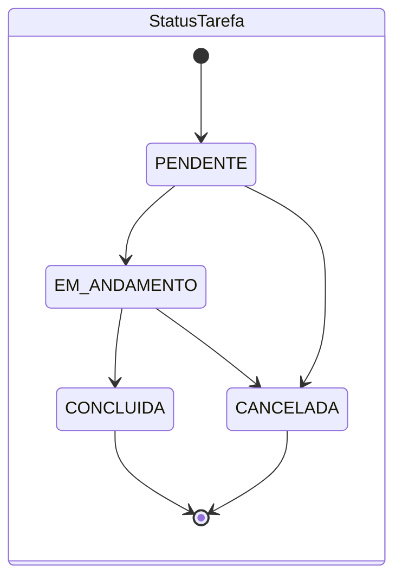

# SistemaUsuario — Sistema de Gestão de Projetos e Equipes

Autor: Wendell

Aplicação **desktop Java Swing** para gestão de usuários, equipes, projetos, tarefas e relatórios, com **controle de acesso por perfil (RBAC)** e persistência local em **SQLite**.  
Arquitetura baseada em **MVC clássico** (View → Controller → DAO → banco), sem frameworks externos além do driver JDBC.

---

## 🚀 Funcionalidades

- Usuário: cadastro com validação de CPF e autenticação por login/senha.
- Equipe: criação de equipes e vínculo de usuários.
- Projeto: cadastro de projetos e associação de equipes.
- Escopo: filtragem de dados conforme participação do colaborador.
- Tarefa: criação de tarefas vinculadas a projetos e responsáveis.
- Relatório: geração de relatórios de desempenho e escopo.

---

## 🛠️ Stack Tecnológica

| Camada | Tecnologia | Versão |
|--------|------------|--------|
| Linguagem | Java (JDK) | 21 |
| Build | Apache Maven | 3.6+ |
| Interface gráfica | Java Swing | nativo do JDK |
| Banco de dados | SQLite (`sqlite-jdbc`) | 3.53.1.0 |
| Testes | JUnit Jupiter (JUnit 5) | 5.14.4 |
| Empacotamento | `maven-shade-plugin` | 3.6.2 |

---

## 📐 Arquitetura

### Diagrama de componentes



---

## Modelo de dados

Seis tabelas no SQLite (DDL em `src/main/resources/db/schema.sql`). As duas
tabelas de junção (`equipe_usuario`, `projeto_equipe`) modelam relações
muitos-para-muitos. Datas são persistidas como `TEXT` (ISO) e enums via o
`name()` da constante.



---

## Fluxos

### Autenticação e navegação



### Estados de projeto e tarefa




---

## Perfis e permissões

O acesso aos recursos é resolvido de forma declarativa em
`security/PermissoesPerfil` (mapa `PerfilUsuario → conjunto de recursos`). A
`MainView` renderiza apenas os botões permitidos e revalida o acesso antes de
abrir cada tela (defesa em profundidade).

| Recurso | Administrador | Gerente | Colaborador |
| --- | --- | --- | --- |
| Usuários | ✅ | — | — |
| Equipes | ✅ | ✅ | — |
| Projetos | ✅ | ✅ | — |
| Escopo | ✅ | ✅ | ✅ |
| Tarefas | ✅ | ✅ | ✅ (modo leitura) |
| Relatórios | ✅ | ✅ | ✅ |

O **Colaborador** visualiza apenas dados das equipes de que participa
(`EscopoColaborador`) e não pode criar, editar nem excluir registros.

---

## Pré-requisitos

| Ferramenta | Versão mínima |
| --- | --- |
| JDK | 21 |
| Apache Maven | 3.6 |
| Git | qualquer |
| Ambiente gráfico | A interface Swing exige um display (não roda em servidor headless) |

Verifique as versões com:

```bash
java -version
mvn -version
```

---

## Instalação e configuração

### Linux

**Opção A — gerenciador de pacotes (Debian/Ubuntu):**

```bash
sudo apt update
sudo apt install -y openjdk-21-jdk maven git
git clone <URL-REPOSITORIO>
cd SistemaUsuario
mvn clean package
java -jar target/SistemaUsuario.jar
```

**Opção B — SDKMAN (qualquer distribuição):**

```bash
curl -s "https://get.sdkman.io" | bash
source "$HOME/.sdkman/bin/sdkman-init.sh"
sdk install java 21-tem
sdk install maven
git clone <URL-DO-REPOSITORIO>
cd SistemaUsuario
mvn clean package
java -jar target/SistemaUsuario.jar
```

### Windows

**Opção A — winget (PowerShell):**

```powershell
winget install EclipseAdoptium.Temurin.21.JDK
winget install Apache.Maven
winget install Git.Git
git clone <URL-REPOSITORIO>
cd SistemaUsuario
mvn clean package
java -jar target\SistemaUsuario.jar
```

Feche e reabra o terminal para recarregar o `PATH`. Se o Maven não definir o
`JAVA_HOME` automaticamente, configure-o:

```powershell
setx JAVA_HOME "C:\Program Files\Eclipse Adoptium\jdk-21"
```

**Opção B — instalação manual:**

1. Baixe e instale o JDK 21 (Temurin/Oracle).
2. Baixe o Apache Maven, extraia e adicione a pasta `bin` ao `PATH`.
3. Defina `JAVA_HOME` apontando para a pasta do JDK.

---

## Comandos principais

Todos executados na raiz do projeto (onde está o `pom.xml`):

| Comando | Descrição |
| --- | --- |
| `mvn clean` | Remove artefatos antigos |
| `mvn compile` | Compila o código |
| `mvn test` | Executa testes JUnit |
| `mvn package` | Gera o JAR executável |
| `java -jar target/SistemaUsuario.jar` | Executa o sistema |

---

## Como executar

Após `mvn package`, execute o fat jar:

```bash
java -jar target/SistemaUsuario.jar
```

No primeiro acesso, use as credenciais do administrador criadas automaticamente:

| Login | Senha |
|-------|-------|
| `admin` | `admin` |

> A senha é armazenada em texto simples nesta versão (uso acadêmico). Não use credenciais reais.

---

## Banco de dados

- Engine: **SQLite**, arquivo único em `data/sistemausuario.db`, criado relativo ao diretório de execução.
- O schema é aplicado automaticamente na inicialização por `database/DatabaseMigrator` (a partir de `src/main/resources/db/schema.sql`, com `CREATE TABLE IF NOT EXISTS` — idempotente).
- As chaves estrangeiras são habilitadas por conexão (`PRAGMA foreign_keys = ON` em `DatabaseConnection`), pois o SQLite as desativa por padrão.
- Para reiniciar do zero, basta apagar o arquivo `.db` — ele será recriado e o admin inicial semeado novamente.

---

## Estrutura do projeto

```text
SistemaUsuario/
├── pom.xml
├── README.md
├── data/                          # banco SQLite gerado em runtime (não versionado)
└── src/
    ├── main/
    │   ├── java/br/com/sistemausuario/
    │   │   ├── view/Main.java     # ponto de entrada + wiring de dependências
    │   │   ├── config/            # AppConfig (sessão Singleton)
    │   │   ├── controller/        # regras de negócio
    │   │   ├── dao/               # acesso a dados (JDBC)
    │   │   ├── database/          # conexão e migração
    │   │   ├── exception/         # exceções de domínio
    │   │   ├── model/             # entity, enums, dto, filter
    │   │   ├── security/          # RBAC (PermissoesPerfil) e escopo (EscopoColaborador)
    │   │   └── view/              # telas Swing
    │   └── resources/db/
    │       └── schema.sql         # DDL das tabelas
    └── test/
        └── java/br/com/sistemausuario/  # testes JUnit 5
```
